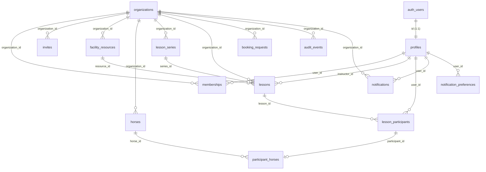
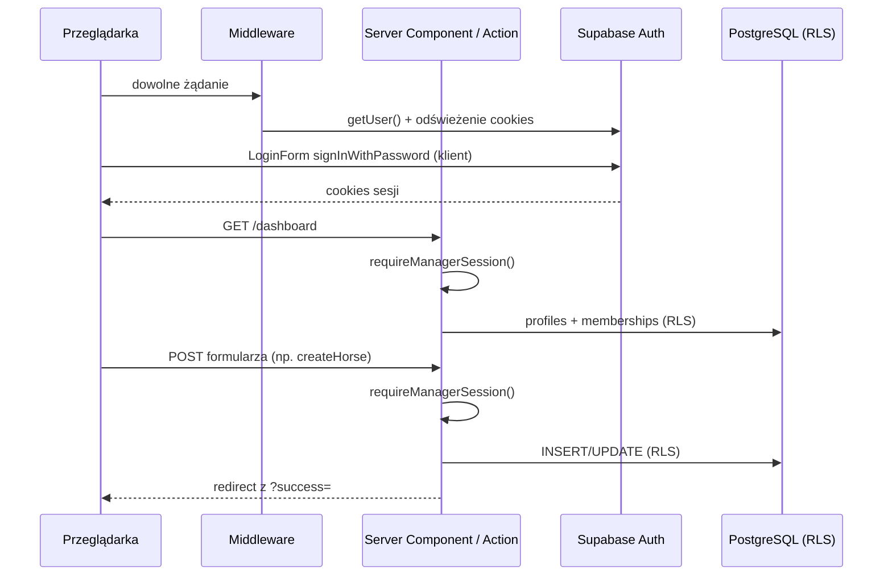

# Jak działa aplikacja — stan aktualny

**Status:** dokument opisuje **rzeczywisty, zaimplementowany stan** repozytorium (nie plan).
**Zakres:** architektura, model danych, bezpieczeństwo, uwierzytelnianie, logika biznesowa, frontend.

Dokumenty pokrewne:

- [`docs/product-mvp.md`](./product-mvp.md) — specyfikacja produktu (czego chcemy).
- [`docs/technical-plan.md`](./technical-plan.md) — plan techniczny i etapy (jak zamierzamy budować).
- **Ten dokument** — co faktycznie działa dzisiaj i w jaki sposób.

> Legenda statusu w całym dokumencie:
> ✅ zaimplementowane · 🟡 częściowo / niepodłączone do UI · ⛔ jeszcze nie istnieje

---

## 1. Czym jest projekt

Equestrian Scheduler to **kalendarzowy system rezerwacji dla ośrodków jeździeckich**. Zasada przewodnia: *wszystko jest kalendarzem* — plan zajęć, prośby o termin, odwołania i wolne sloty to różne widoki i uprawnienia na tym samym kalendarzu.

Architektura jest **wielodostępna (multi-tenant)**: każdy rekord domenowy należy do organizacji (`organization_id`), a izolacja danych jest wymuszana w bazie przez Row Level Security (RLS), nie tylko w interfejsie.

Aktualnie zaimplementowany jest **Etap 0** (szkielet monorepo, CI, wspólne pakiety) i **Etap 1** (schemat bazy, RLS, zaproszenia, podstawy panelu managera). Kalendarz webowy (Etap 2) i aplikacja mobilna (Etap 3) są jeszcze przed nami — logika kalendarza istnieje jako biblioteka, ale nie jest podłączona do UI.

---

## 2. Architektura i stack

Monorepo oparte na **pnpm workspaces + Turborepo**.

```text
equestrian-scheduler/
├── apps/
│   ├── web/       # Next.js 15 (App Router) — panel managera/admina      ✅
│   └── mobile/    # Expo 52 / React Native — szkielet                    🟡
├── packages/
│   ├── domain/    # encje, typy, porty, uprawnienia (bez frameworków)    ✅
│   ├── calendar/  # wykrywanie kolizji, obciążenie konia, obłożenie      🟡 (gotowe, niepodłączone)
│   ├── ui-tokens/ # kolory, odstępy, typografia, cienie, radiusy         ✅
│   └── config/    # wspólne configi TypeScript i ESLint                  ✅
├── supabase/
│   ├── migrations/  # 5 migracji PostgreSQL                              ✅
│   ├── seed.sql     # dane testowe (1 ośrodek, 2 zasoby, 2 konie)        ✅
│   └── functions/   # brak Edge Functions (tylko .gitkeep)               ⛔
└── docs/
```

| Warstwa | Technologia |
| --- | --- |
| Panel webowy | Next.js 15 (App Router), React 18, TypeScript |
| Aplikacja mobilna | Expo 52, React Native 0.76, TypeScript |
| Backend / baza / auth | Supabase (PostgreSQL 17, Auth, RLS) |
| Style webowe | inline style + tokeny z `@equestrian-scheduler/ui-tokens` (bez Tailwind/UI-libów) |
| Narzędzia | pnpm 9.15.9, Turborepo, Prettier, ESLint |
| CI | GitHub Actions (`format:check` → `lint` → `typecheck` → `build`) |

**Wzorzec architektoniczny:** heksagonalny (porty i adaptery). `packages/domain` zawiera czyste encje i interfejsy repozytoriów, a persystencja (Supabase), e-mail i UI implementują reguły na zewnątrz. `packages/calendar` to biblioteka czystych funkcji do walidacji harmonogramu.

Web transpiluje pakiety workspace w `next.config.ts`; pakiety `domain`, `calendar`, `ui-tokens` kompilują TypeScript do `dist/` (`"type": "module"`).

---

## 3. Model danych (PostgreSQL / Supabase)

15 tabel w schemacie `public`, wszystkie z włączonym RLS. Źródło: `supabase/migrations/`.

### 3.1 Diagram relacji



### 3.2 Tabele

| Tabela | Rola | Kluczowe kolumny / reguły |
| --- | --- | --- |
| `organizations` | ośrodek (tenant) | `name`, `timezone` (dom. `Europe/Warsaw`), `calendar_opens_at`/`calendar_closes_at` (godziny 07:00–22:00, check `closes > opens`), `logo_url`, `archived_at` |
| `profiles` | profil użytkownika (1:1 z `auth.users`) | `first_name`, `last_name`, `email` (unikalny, z `@`), `phone` (≥9 znaków), `is_product_admin` (**chroniona kolumna**), `active_organization_id` |
| `memberships` | powiązanie użytkownik ↔ ośrodek + rola | `role` (`membership_role`), unikat `(organization_id, user_id)`, `archived_at` |
| `invites` | zaproszenia e-mail | `token` (64-hex, auto), `role` (≠ `product_admin`), `expires_at` (dom. `now()+7 dni`), `status`, `invited_by`, `accepted_by/at` |
| `facility_resources` | zasób (hala/ujeżdżalnia) | `type` (`resource_type`), `parallel_capacity` (≥1), `archived_at` |
| `horses` | koń szkolny | `daily_ride_limit` (≥1, dom. 4), `is_active`, `archived_at` |
| `lesson_series` | szablon cyklicznej lekcji tygodniowej | `day_of_week` (0–6), `starts_at`/`ends_at` (time, check `ends > starts`), `max_participants`, `starts_on`/`ends_on` |
| `lessons` | konkretna lekcja w kalendarzu | `starts_at`/`ends_at` (timestamptz, check `ends > starts`), `status` (`active`/`cancelled`), `max_participants`, `series_id`, `is_series_exception`, metadane odwołania (check: przy `cancelled` wymagane `cancelled_by`+`cancelled_at`) |
| `lesson_participants` | uczestnik lekcji | unikat `(lesson_id, user_id)`, `status`, `payment_status` (`paid`/`unpaid`), metadane odwołania |
| `participant_horses` | koń przypisany do uczestnika | unikat `(participant_id)` → **1 koń na uczestnika** |
| `booking_requests` | prośba o termin | `requested_by`, `resource_id`, `instructor_id?`, `status` (`pending`/`approved`/`rejected`), `decided_by/at` |
| `audit_events` | dziennik zmian (append-only) | `actor_id`, `action`, `entity_type`, `entity_id`, `previous_value`/`new_value` (jsonb) |
| `notifications` | powiadomienia w aplikacji | `category`, `title`, `body`, `read_at` |
| `notification_preferences` | preferencje powiadomień | PK `(user_id, organization_id)`, `reminders_enabled`, `schedule_changes_enabled` |

### 3.3 Typy wyliczeniowe (enum)

| Enum | Wartości |
| --- | --- |
| `membership_role` | `product_admin`, `manager`, `instructor`, `client`, `boarder` |
| `lesson_status` | `active`, `cancelled` |
| `participant_status` | `active`, `cancelled` |
| `payment_status` | `paid`, `unpaid` |
| `invite_status` | `pending`, `accepted`, `expired` |
| `booking_request_status` | `pending`, `approved`, `rejected` |
| `resource_type` | `indoor`, `outdoor_arena`, `other` |
| `notification_category` | `reminder`, `schedule_change`, `booking_request`, `instructor_message`, `account_security` |

### 3.4 Wzorce w modelu

- **Multi-tenant:** niemal każda tabela ma `organization_id`; dostęp wynika z `memberships.role`.
- **Soft delete:** `archived_at` na organizacji, członkostwie, zasobie, koniu, serii. Helpery RLS traktują zarchiwizowane członkostwo jako brak członkostwa (`archived_at is null`).
- **Historia odwołań:** odwołane lekcje/udziały zachowują `cancelled_by`, `cancelled_at`, `cancellation_reason` (nie są kasowane).
- **Rozdzielczość czasu:** 15 minut (`TIME_SLOT_MINUTES` w domenie) — konwencja siatki kalendarza.
- **Triggery `updated_at`:** funkcja `set_updated_at()` na wszystkich tabelach z tą kolumną.

---

## 4. Bezpieczeństwo i uprawnienia

Bezpieczeństwo działa na trzech warstwach: **strażnicy sesji** (redirecty w Next.js) → **akcje serwerowe** (te same strażniki) → **RLS w PostgreSQL** (ostateczna linia obrony na każdym zapytaniu).

### 4.1 Dwa niezależne pojęcia uprawnień

| Pojęcie | Gdzie przechowywane | Do czego służy |
| --- | --- | --- |
| **Product admin** | `profiles.is_product_admin` (boolean) | dostęp do `/admin/*`, tworzenie ośrodków, obejście wymogu członkostwa managera, RLS `is_product_admin()` |
| **Rola w ośrodku** | `memberships.role` | uprawnienia w obrębie danej organizacji; przypisywana przez zaproszenie |

> Ważne: dostęp do stron product-admina w panelu webowym zależy od `profiles.is_product_admin`, a **nie** od roli członkostwa `product_admin`. Zaproszenia nie mogą nadać roli `product_admin` (check w bazie + walidacja w akcji). Flagę `is_product_admin` może ustawić tylko `service_role`/SQL.

### 4.2 Hierarchia i macierz ról

Ranking (`packages/domain/src/use-cases/permissions.ts`): `product_admin` (100) > `manager` (80) > `instructor` (60) > `client` / `boarder` (40).

| Uprawnienie (funkcja domeny) | product_admin | manager | instructor | client | boarder |
| --- | :--: | :--: | :--: | :--: | :--: |
| `canManageOrganization` | ✅ | ✅ | — | — | — |
| `canOperateLessons` | ✅ | ✅ | ✅ | — | — |
| `canViewAllLessons` | ✅ | ✅ | ✅ | — | — |
| `canCancelEntireLesson` | ✅ | ✅ | ✅ | — | — |
| `canApproveBookingRequests` | ✅ | ✅ | — | — | — |
| `canCancelOwnParticipation` | — | — | — | ✅ | ✅ |

Dostęp do UI (stan obecny):

| Rola / flaga | `/dashboard/*` | `/admin/organizations` |
| --- | :--: | :--: |
| `is_product_admin = true` | ✅ (nawet bez członkostwa) | ✅ |
| członkostwo `manager` | ✅ | — |
| `instructor` / `client` / `boarder` | ⛔ (redirect na `/login`) | — |

### 4.3 RLS — polityki (33) i helpery

Polityki nie mają klauzuli `TO role`, więc obowiązują wszystkie role DB. W praktyce: `authenticated` ma pełne CRUD, ale każdy wiersz jest filtrowany przez RLS; `anon` nie ma dostępu do tabel (poza RPC `get_invite_preview`); `service_role` **omija RLS** (operacje serwerowe/admina).

Logika wielotabelowa jest zamknięta w funkcjach `SECURITY DEFINER` (omijają RLS na odczytach wewnętrznych) — to rozwiązuje problem rekursji polityk:

| Helper | Znaczenie |
| --- | --- |
| `is_product_admin()` | `profiles.is_product_admin` dla `auth.uid()` |
| `is_member_of_org(org)` | aktywne (niezarchiwizowane) członkostwo |
| `get_membership_role(org)` | rola użytkownika w ośrodku |
| `can_manage_org(org)` | product admin **lub** manager |
| `can_operate_lessons(org)` | product admin **lub** manager **lub** instructor |
| `is_client_or_boarder(org)` | client lub boarder |
| `shares_operable_org_with(profile)` | operator dzieli ośrodek z danym profilem |
| `is_lesson_participant(lesson)` / `can_operate_lesson(lesson)` / `can_view_lesson_participants(lesson)` | reguły dostępu do lekcji i uczestników |
| `can_view_participant_horse` / `can_manage_participant_horse` | dostęp do przypisań koni |

Przykładowe reguły (uproszczony język):

- **organizations:** SELECT — member lub product admin; INSERT — tylko product admin; UPDATE — `can_manage_org`.
- **facility_resources / horses:** SELECT — dowolny member; zapis (ALL) — `can_manage_org`.
- **lessons:** SELECT — operatorzy albo member będący uczestnikiem; zapis — `can_operate_lessons`.
- **lesson_participants:** SELECT — własny wiersz albo operator/współuczestnik; zapis — operator; UPDATE własnego wiersza (self-cancel) — `user_id = auth.uid()`.
- **booking_requests:** INSERT — client/boarder dla siebie; UPDATE (decyzja) — manager; SELECT — wnioskujący albo manager.
- **notifications / notification_preferences:** użytkownik widzi/edytuje wyłącznie własne.
- **audit_events:** SELECT — manager; INSERT — operator/manager; brak UPDATE/DELETE (append-only).

### 4.4 Ochrona przed eskalacją uprawnień

Kolumna `profiles.is_product_admin` jest chroniona wielowarstwowo (migracje 3 i 4):

1. `REVOKE UPDATE (is_product_admin)` dla `anon`/`authenticated`.
2. `authenticated` ma UPDATE tylko na kolumnach: `first_name`, `last_name`, `phone`, `active_organization_id`.
3. Trigger `enforce_profile_protected_columns` blokuje zmianę wartości (błąd `42501`).

### 4.5 RPC dostępne publicznie

`get_invite_preview(invite_token text)` — `SECURITY DEFINER`, `EXECUTE` dla `anon` i `authenticated`. Zwraca e-mail, rolę i nazwę ośrodka dla zaproszeń `pending` i niewygasłych, bez bezpośredniego dostępu do tabeli `invites`.

---

## 5. Uwierzytelnianie i sesja

Pliki: `apps/web/src/lib/auth/*`, `apps/web/src/lib/supabase/*`, `apps/web/src/middleware.ts`.

### 5.1 Klienci Supabase

| Klient | Plik | Klucz | Zastosowanie |
| --- | --- | --- | --- |
| przeglądarkowy | `supabase/client.ts` | anon | `LoginForm` (logowanie po stronie klienta) |
| serwerowy (SSR) | `supabase/server.ts` | anon | akcje serwerowe, komponenty serwerowe, `getSession()` |
| middleware | `supabase/middleware.ts` | anon | odświeżanie tokenów na każdym żądaniu |
| admin | `supabase/admin.ts` | **service_role** | tworzenie użytkowników i bootstrap członkostw (omija RLS) |

### 5.2 Przepływy



- **Rejestracja (`signUp`)** ✅ — walidacja (hasło ≥8, telefon ≥9 cyfr), `admin.createUser` z `email_confirm: true`; trigger `handle_new_user()` zakłada wiersz w `profiles`. **Nie tworzy członkostwa** — samodzielnie zarejestrowane konto nie ma dostępu do panelu, dopóki nie zostanie zaproszone lub oznaczone jako product admin.
- **Logowanie** ✅ — po stronie klienta (`signInWithPassword`), potem `router.push('/dashboard')`. (Akcja serwerowa `signIn` istnieje, ale nie jest podłączona do UI.)
- **Wylogowanie (`signOut`)** ✅ — `auth.signOut()` + redirect na `/login`.
- **Reset hasła** ✅ — `requestPasswordReset` (e-mail z `redirectTo=/reset-password`) → `updatePassword` (`updateUser({ password })`).
- **Akceptacja zaproszenia (`acceptInvite`)** ✅ — przez klienta admin: odczyt zaproszenia → utworzenie użytkownika → uzupełnienie profilu → wstawienie członkostwa z rolą z zaproszenia → oznaczenie zaproszenia jako `accepted` → ustawienie `active_organization_id` → zalogowanie.
- **Callback OAuth/PKCE** (`/auth/callback`) ✅ — `exchangeCodeForSession`.

### 5.3 Sesja i strażnicy

`getSession()` buduje obiekt `UserSession`: `userId`, `email`, `profile` (w tym `isProductAdmin`, `activeOrganizationId`), `membership` (aktywne) oraz lista `memberships`. Aktywne członkostwo wybierane jest wg `active_organization_id`, w przeciwnym razie pierwsze z listy.

| Strażnik | Wymaga | Redirect przy braku |
| --- | --- | --- |
| `requireSession()` | zalogowany + profil | `/login?error=Sesja wygasła…` |
| `requireManagerSession()` | `isProductAdmin` **lub** członkostwo z `canManageOrganization` | `/login?error=…brak dostępu do panelu managera…` |
| `requireProductAdminSession()` | `profile.isProductAdmin` | `/dashboard` |

### 5.4 Middleware

`apps/web/src/middleware.ts` uruchamia `updateSession` na wszystkich trasach poza statycznymi. **Tylko odświeża sesję — nie przekierowuje i nie chroni tras.** Ochrona odbywa się w strażnikach layoutów/stron oraz w RLS.

---

## 6. Akcje serwerowe (server actions)

Wszystkie z dyrektywą `'use server'`, UX oparte na redirectach z parametrami `?success=`/`?error=`.

### 6.1 Auth — `apps/web/src/lib/auth/actions.ts`

| Akcja | Wejście | Operacje |
| --- | --- | --- |
| `signUp` | firstName, lastName, phone, email, password | admin `createUser` → trigger tworzy `profiles` |
| `signIn` 🟡 | email, password | `signInWithPassword` (niepodłączone do UI) |
| `signOut` | — | `signOut()` + redirect |
| `requestPasswordReset` | email | `resetPasswordForEmail` |
| `updatePassword` | password | `updateUser({ password })` |
| `acceptInvite` | token + dane profilu + hasło | odczyt zaproszenia, `createUser`, update `profiles`, insert `memberships`, update `invites`, set `active_organization_id`, `signInWithPassword` |

### 6.2 Panel — `apps/web/src/lib/dashboard/actions.ts`

| Akcja | Strażnik | Operacja |
| --- | --- | --- |
| `updateOrganization` | manager | UPDATE `organizations` (nazwa, timezone, godziny, logo) |
| `createResource` / `archiveResource` | manager | INSERT / soft-delete `facility_resources` |
| `createHorse` / `archiveHorse` | manager | INSERT / soft-delete `horses` (+ `is_active=false`) |
| `createInvite` | manager | INSERT `invites` (rola ≠ `product_admin`), zwraca link `{APP_URL}/invite/{token}` |
| `createOrganization` | product admin | INSERT `organizations` + `memberships` (manager) + set `active_organization_id` |
| `switchOrganization` 🟡 | (tylko auth) | UPDATE `profiles.active_organization_id` (niepodłączone do UI) |

> **Zaproszenia są linkowe, nie e-mailowe.** Manager kopiuje URL z komunikatu sukcesu lub z tabeli na stronie zespołu. Wysyłka e-mail (Resend) — ⛔ jeszcze nie zintegrowana.

---

## 7. Logika biznesowa (pakiety współdzielone)

### 7.1 `@equestrian-scheduler/domain`

Czysty model domenowy, **bez walidacji runtime** (typowanie strukturalne TS):

- **Typy ID z brandem:** `OrganizationId`, `UserId`, `LessonId`, `HorseId`, `ResourceId` + fabryki `create*Id`.
- **Encje:** `Organization`, `Profile`, `Membership`, `FacilityResource`, `Horse`, `Lesson`, `LessonParticipant`, `ParticipantHorse`, `BookingRequest`, `Invite`. Czasy jako ISO stringi.
- **Porty (interfejsy repozytoriów i usług):** `OrganizationRepository`, `ProfileRepository`, `MembershipRepository`, `FacilityResourceRepository`, `HorseRepository`, `LessonRepository`, `LessonParticipantRepository`, `BookingRequestRepository`, `InviteRepository`, `AuthService`, `NotificationService`, `AuditLogger`, `CurrentUserContext`. **Brak implementacji** (adaptery powstaną w apps/Supabase).
- **Uprawnienia:** funkcje z sekcji 4.2 + `hasRoleAtLeast`.
- **Stałe:** `TIME_SLOT_MINUTES = 15`, `DEFAULT_TIMEZONE = 'Europe/Warsaw'`.

### 7.2 `@equestrian-scheduler/calendar` 🟡

Biblioteka czystych funkcji do walidacji harmonogramu. **Kompletna, ale jeszcze nieużywana przez żaden kod aplikacji** (kalendarz webowy dopiero powstanie).

- `rangesOverlap(a, b)` — nakładanie przedziałów (stykające się końce **nie** nakładają się).
- `detectLessonConflicts(...)` — silnik wykrywania kolizji, zwraca listę `CalendarConflict`. Pięć typów konfliktu:

| Typ | Warunek |
| --- | --- |
| `resource_capacity` | liczba równoległych aktywnych lekcji na zasobie > `parallel_capacity` |
| `instructor_overlap` | instruktor ma inną aktywną lekcję w tym czasie |
| `group_capacity` | liczba uczestników > `max_participants` |
| `horse_overlap` | koń jest już przypisany do innej lekcji w tym samym dniu i czasie |
| `horse_daily_limit` | dzienna liczba jazd konia ≥ jego `daily_ride_limit` |

- **Wszystkie konflikty mają dziś `severity: 'warning'`** — zgodnie z MVP są ostrzeżeniami z możliwością potwierdzenia, nie twardą blokadą.
- Przy edycji lekcji (`lessonId` podany) lekcja jest wykluczana z porównań, a jej własne konie nie są flagowane (`isSameLessonHorse`).
- `calculateHorseUtilization` / `formatHorseUtilization` — metryki obciążenia (np. `"80% (4/5 rides)"`, procent ograniczony do 100, zabezpieczenie przed dzieleniem przez zero).
- `calculateAnonymousResourceOccupancy` — liczba aktywnych lekcji na zasobie w danym przedziale (do anonimowego obłożenia hali).

> Uwaga techniczna: granica „dnia" dla konia liczona jest przez `Date.toDateString()` (lokalna strefa `Date`); okno godzin ośrodka (`calendar_opens_at/closes_at`) i wyrównanie do 15 min są odpowiedzialnością wywołującego adaptera — jeszcze nie zaimplementowane.

---

## 8. Frontend

### 8.1 Panel webowy (`apps/web`)

Style: inline `style` + tokeny z `ui-tokens`; zmienne CSS wstrzykiwane w root layout, globalny CSS zapewnia stany hover/focus, tabele, nawigację. Kopia interfejsu jest w języku polskim (`lang="pl"`).

Trasy:

| Trasa | Opis | Strażnik |
| --- | --- | --- |
| `/` | redirect → `/dashboard` | — |
| `/login`, `/register`, `/forgot-password`, `/reset-password`, `/invite/[token]` | strefa auth (wspólny layout) | publiczne |
| `/auth/callback` | wymiana kodu na sesję | publiczne |
| `/dashboard` | przegląd (kafle sekcji) | manager |
| `/dashboard/organization` | ustawienia ośrodka | manager |
| `/dashboard/resources` | CRUD zasobów | manager |
| `/dashboard/horses` | CRUD koni | manager |
| `/dashboard/team` | członkowie + zaproszenia | manager |
| `/admin/organizations` | tworzenie ośrodków | product admin |

Komponenty współdzielone (`apps/web/src/components/`): `Card`, `PageHeader`, `SectionTitle`, `Field`, `Input`, `Select`, `Button`, `Table`, `Badge`, `EmptyState`, `ErrorMessage`, `SuccessMessage`, `NavLink` (aktywny stan), zestaw ikon SVG, `LoginForm`.

### 8.2 Aplikacja mobilna (`apps/mobile`) 🟡

Szkielet Expo z placeholderowym ekranem. Klient Supabase istnieje (`src/lib/supabase/client.ts`), ale nie jest użyty w `App.tsx`. Współdzieli `domain`, `calendar`, `ui-tokens`. Brak nawigacji, logowania i widoków kalendarza.

---

## 9. Konfiguracja i uruchomienie

### 9.1 Zmienne środowiskowe

| Plik | Zmienne |
| --- | --- |
| `apps/web/.env.local` | `NEXT_PUBLIC_SUPABASE_URL`, `NEXT_PUBLIC_SUPABASE_ANON_KEY`, `SUPABASE_SERVICE_ROLE_KEY`, `NEXT_PUBLIC_APP_URL` |
| `apps/mobile/.env` | `EXPO_PUBLIC_SUPABASE_URL`, `EXPO_PUBLIC_SUPABASE_ANON_KEY` |
| `.env.supabase.local` | `DEV_PROJECT_REF`, `DEV_DB_PASSWORD`, `PROD_PROJECT_REF`, `PROD_DB_PASSWORD` |

Zmienne dla Resend (e-mail) i Sentry (monitoring) — ⛔ jeszcze nie skonfigurowane.

### 9.2 Najważniejsze komendy

```bash
pnpm install                                        # instalacja
pnpm build                                          # build wszystkich pakietów
pnpm --filter @equestrian-scheduler/web dev         # panel webowy (localhost:3000)
pnpm --filter @equestrian-scheduler/web typecheck   # kontrola typów
pnpm db:push                                         # migracje do połączonego projektu Supabase
pnpm supabase:start && pnpm db:reset                 # lokalny stack + reset z seedem
```

### 9.3 Dane testowe (`supabase/seed.sql`)

1 ośrodek („Ośrodek testowy", `Europe/Warsaw`, 07:00–22:00), 2 zasoby („Hala" indoor/2, „Ujeżdżalnia" outdoor/3), 2 konie („Rapan", „Błysk", limit 4). Bez użytkowników/członkostw — te powstają przez rejestrację/bootstrap.

### 9.4 Migracje (chronologicznie)

| # | Plik | Zawartość |
| --- | --- | --- |
| 1 | `20260714210000_initial_schema.sql` | pełny schemat MVP: enumy, 15 tabel, indeksy, triggery, `handle_new_user`, helpery i polityki RLS |
| 2 | `20260715160000_etap1_auth_helpers.sql` | polityka `memberships_insert_product_admin`, RPC `get_invite_preview` |
| 3 | `20260715190000_fix_profile_privilege_escalation.sql` | ochrona `is_product_admin` (REVOKE + trigger) |
| 4 | `20260715200000_grant_api_role_privileges.sql` | granty CRUD dla `authenticated`/`service_role`, ponowne zawężenie UPDATE na `profiles` do wybranych kolumn |
| 5 | `20260718140000_fix_rls_mutual_recursion.sql` | helpery `SECURITY DEFINER` rozwiązujące rekursję polityk RLS (profiles/lessons/participants/participant_horses) |

---

## 10. Stan implementacji — podsumowanie

| Obszar | Status | Uwagi |
| --- | --- | --- |
| Monorepo, CI, pakiety współdzielone | ✅ | Etap 0 |
| Schemat bazy + RLS + zaproszenia | ✅ | Etap 1 |
| Auth: rejestracja, logowanie, reset, zaproszenia | ✅ | logowanie po stronie klienta |
| Panel managera: ośrodek, zasoby, konie, zespół | ✅ | CRUD z soft-delete |
| Panel product-admina: tworzenie ośrodków | ✅ | faza pilotażu |
| Biblioteka kalendarza (kolizje, obciążenie) | 🟡 | gotowa, niepodłączona do UI |
| Kalendarz webowy (widok dnia/tygodnia, DnD, serie) | ⛔ | Etap 2 |
| Aplikacja mobilna (logowanie, jazdy, wolne sloty) | ⛔ | Etap 3, obecnie szkielet |
| Powiadomienia (push/e-mail), przypomnienia | ⛔ | Etap 4 |
| Wysyłka e-mail zaproszeń (Resend) | ⛔ | dziś link kopiowany ręcznie |
| Edge Functions, audit log w kodzie, Sentry | ⛔ | tabele istnieją, brak integracji |

### Znane luki / dług techniczny

- Akcja `signIn` i `switchOrganization` istnieją, ale nie są podłączone do UI.
- Samodzielna rejestracja tworzy „osierocone" konto (profil bez członkostwa).
- Biblioteka `calendar` nie jest jeszcze wywoływana — brak adaptera mapującego encje domeny na snapshoty i decydującego, czy ostrzeżenie blokuje zapis.
- Brak testów jednostkowych/e2e (pierwszy kandydat: logika kolizji i obciążenia konia).
- Wdrożenia (Vercel) nie są jeszcze skodyfikowane w repo (brak `vercel.json`).
